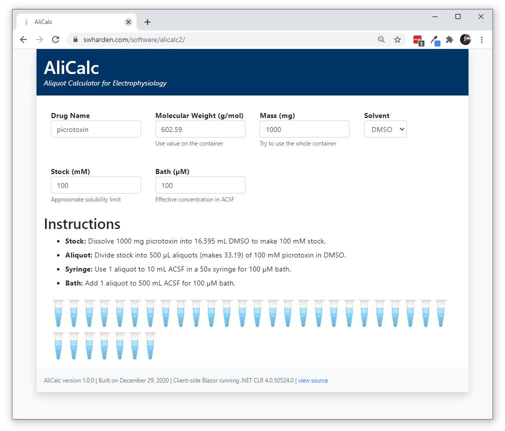

# AliCalc-Blazor

**AliCalc is an aliquot calculator for electrophysiology experiments.** This repository implements AliCalc as a progressive web application (PWA) using Blazor (C# and WebAssembly).

* [**AliCalc-Blazor Website**](https://swharden.com/software/alicalc2)

**AliCalc-JS** is a similar project created with React (JavaScript).
 * [**AliCalc-JS Website**](https://swharden.com/software/alicalc)
 * [**AliCalc-JS Repository**](https://github.com/swharden/AliCalc)